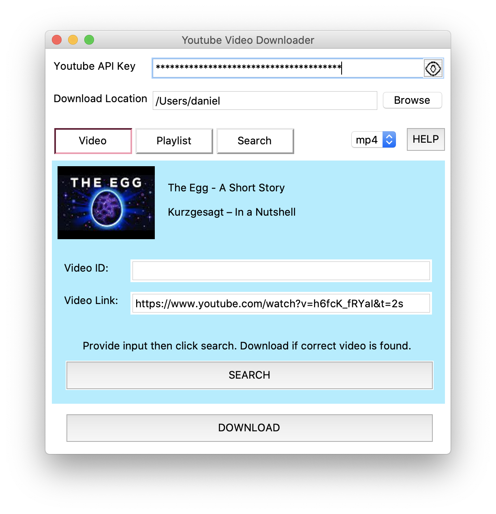
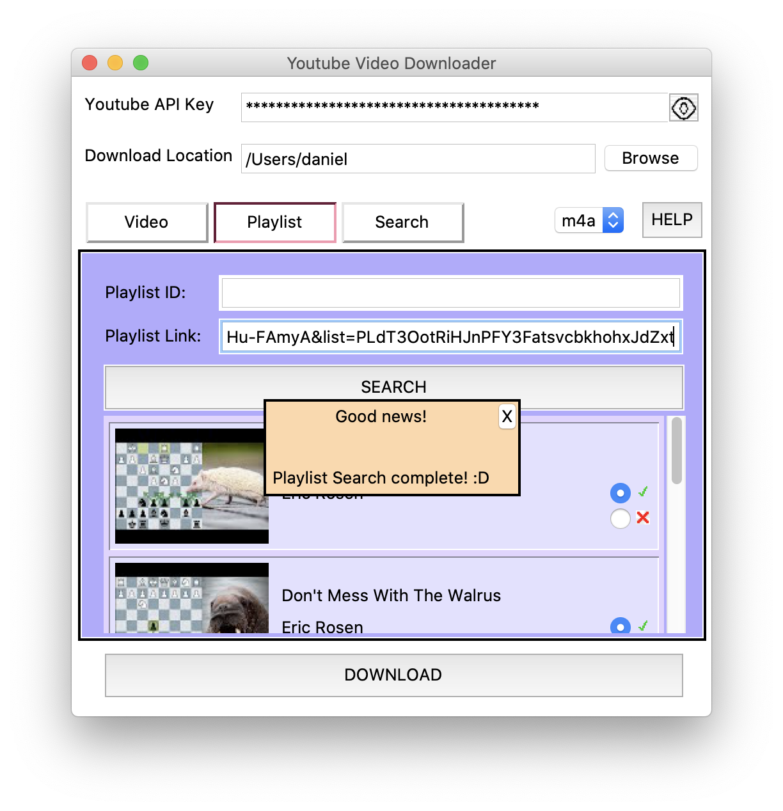
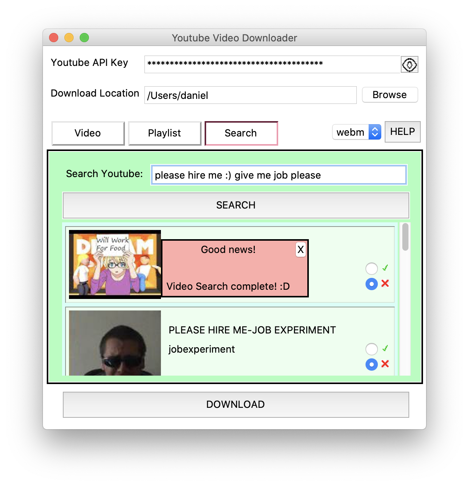
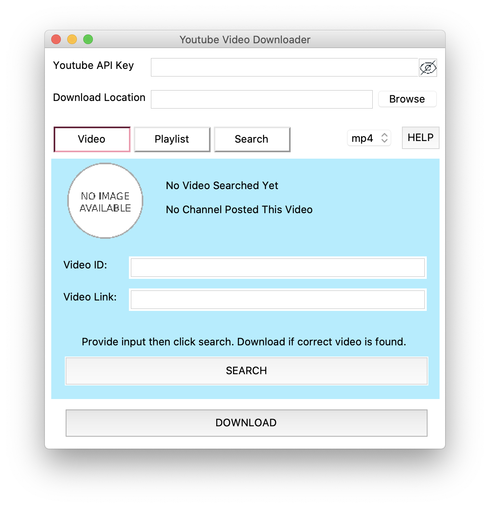

# Youtube Video Downloader

The **Youtube Video Downloader** was made to download public Youtube videos, so that videos could be watched multiple times, every without internet. 
A key feature of the Youtube Video Downloader is its ability to download full public playlists with just the click of a button.
As well, videos that have already been downloaded in a given folder will not be re-downloaded, to avoid uselessly taking up storage space.

A suggested usage of the Youtube Video Downloader is to maintain a public Youtube playlist, which could be updated with videos as the user pleases.
Downloading these videos efficiently is now trivial with the Youtube Video Downloader, so your hard drive playlist can keep perfectly up to date with your preferred youtube playlists

### Getting Started:
Copy the folder and its contents onto your computer. 
Ensure you have downloaded all prerequisites dictated by requirements.txt

In order to run the program, simply run interface.py
Alternatively, a double-clickable version is available upon request, though there are potential errors with Tkinter in this version.
Tkinter will need to be pre-installed before using the double-clickable version because Tkinter and pyinstaller are not friends :c
Some features may have changed between the double-clickable version and the given code version.

### Deployment:
This app was developed on and for MacOS and has not been tested on other OS.
While there theoretically should be no issues, this is not a guarentee, and some features may be missing or non-functional.
Please note that the usage of relative pathing means that moving files outside of the given folder will cause errors. 
For usage instructions, please consult the in-app HELP button. 

### Background Info/ Additional Notes:
This project was created because I typically listen to music off of youtube. I realized that if my internet cut out, I would have no music and be sad.
Other services offered to download youtube videos for me, but I did not trust them, and thus took matters into my own hands. 
That being said, the app can download any public youtube videos, not just music. 
This app already serves the purpose of its creation, and is considered fully completed. This is an intentional decision meant to avoid feature creep. 
As such, future updates are unlikely.

This was my second project, and I am quite proud of it. I have found it to be useful, and I hope that others find that it helps them as well :D

##### Built With:
Tkinter + PIL - GUI
Youtube-dl - Downloading
googleapiclient - Searching + Youtube API access
tempfile - Temporary resource management
urllib - Data gathering
pathlib - Path management

##### Versioning:
This is the only current available version, 1.0.0

##### License: 
This project is licensed under the MIT License

##### Authors:
Daniel Brestoiu

### Example Images

